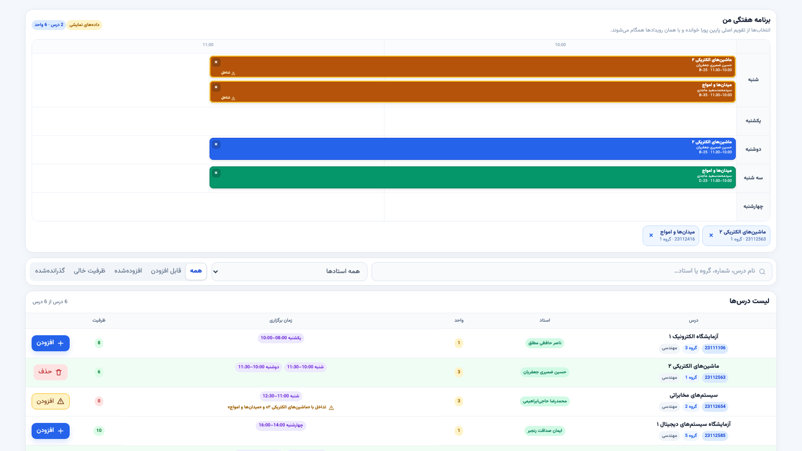

# FumSelector Extension

افزونه‌ای سبک و بدون مرحلهٔ Build برای بازطراحی صفحهٔ **گروه‌های درسی مجاز**
سامانهٔ پویا دانشگاه فردوسی مشهد. رابط قدیمی این صفحه به یک نمای روشن، فشرده و
خوانا با فونت محلی Vazirmatn، جدول مرتب و برنامهٔ هفتگی تعاملی تبدیل می‌شود.



> تصویر بالا صرفاً دمو است و انتخاب‌های واقعی هیچ دانشجویی را نمایش نمی‌دهد.

## قابلیت‌ها

- اجرا به‌صورت خودکار داخل فریم `LeftScr` در صفحهٔ اصلی پویا.
- خواندن مستقیم جدول `ShowCoursesWithPreSelect.php`؛ افزونه درخواست جداگانه‌ای
  برای دریافت لیست درس‌ها ارسال نمی‌کند.
- فونت متغیر Vazirmatn به‌صورت محلی و بدون وابستگی به CDN.
- برنامهٔ هفتگی شنبه تا چهارشنبه با محور زمانی واقعی، رنگ‌بندی درس‌ها، نام استاد
  زیر نام درس و دکمهٔ حذف روی هر بلوک.
- تشخیص تداخل زمانی بین جلسه‌ها، نمایش تداخل در برنامه و زرد شدن دکمهٔ افزودن.
- نمایش نام درس یا درس‌های متداخل و درخواست تأیید پیش از جایگزینی آن‌ها.
- خواندن انتخاب‌های فعلی از رویدادهای تقویم اصلی پویا (`.wc-cal-event`)؛ وضعیت
  کش‌شدهٔ چک‌باکس‌ها منبع تشخیص انتخاب نیست.
- افزودن درس با همان چک‌باکس و تابع اصلی `NewEvent(...)` پویا.
- حذف درس با کلیک برنامه‌ای روی رویداد اصلی تقویم پایین، تا منطق حذف خود پویا
  بدون بازنویسی اجرا شود.
- جستجوی فارسی با یکسان‌سازی حروف و ارقام، فیلتر استاد و فیلتر وضعیت درس.
- نمایش ردیف‌های آبی پویا به‌عنوان «گذرانده‌شده»، غیرفعال کردن افزودن و انتقال
  آن‌ها به انتهای فهرست.
- وسط‌چین شدن تمام ستون‌ها و چیپ‌های زمان؛ ستون واحد و ظرفیت فقط عدد را نشان
  می‌دهد.
- بدون Popup نوار ابزار؛ کلیک روی آیکن افزونه پنجره‌ای باز نمی‌کند.

## منطق همگام‌سازی با پویا

پویا چک‌باکس هر ردیف را به‌عنوان کنترل موقت افزودن نگه می‌دارد و تیک آن الزاماً
نشان‌دهندهٔ انتخاب فعلی نیست. FumSelector نام درس و شمارهٔ گروه را از رویدادهای
تقویم پایین صفحه استخراج و با ردیف متناظر تطبیق می‌دهد. بنابراین برنامهٔ هفتگی،
وضعیت دکمه‌های افزودن/حذف و محاسبهٔ تداخل از انتخاب واقعی پویا ساخته می‌شوند.

هنگام افزودن، افزونه روی کنترل اصلی همان ردیف کلیک می‌کند. هنگام حذف، رویداد
متناظر در تقویم اصلی کلیک می‌شود. یک `MutationObserver` تغییرات تقویم را دنبال
می‌کند تا رابط جدید بعد از پاسخ پویا دوباره همگام شود.

## نصب در Chrome یا Edge

1. فایل ZIP آخرین Release را دانلود و از حالت فشرده خارج کنید.
2. در Chrome نشانی `chrome://extensions` یا در Edge نشانی
   `edge://extensions` را باز کنید.
3. گزینهٔ **Developer mode** را فعال کنید.
4. روی **Load unpacked** بزنید و پوشه‌ای را انتخاب کنید که `manifest.json` در
   ریشهٔ آن قرار دارد.
5. وارد پویا شوید و از منوی «دروس تحصیلی»، صفحهٔ «گروه‌های درسی مجاز» را باز
   کنید.

برای دریافت نسخهٔ جدید، پس از جایگزین کردن فایل‌ها یک‌بار دکمهٔ **Reload** کارت
افزونه را در صفحهٔ Extensions بزنید و صفحهٔ پویا را دوباره باز کنید.

## توسعه و تست محلی

پروژه Build step و وابستگی npm ندارد. برای دیدن رابط با داده‌های ساختگی:

```bash
python3 -m http.server 8765
```

سپس `http://127.0.0.1:8765/demo.html` را باز کنید. دموی محلی شامل انتخاب‌های
ساختگی، تداخل زمانی و شبیه‌سازی افزودن/حذف است و به حساب پویا متصل نمی‌شود.

برای بررسی سینتکس اسکریپت:

```bash
node --check content.js
```

## ساختار پروژه

```text
.
├── manifest.json
├── content.js
├── content.css
├── demo.html
├── fonts/
│   └── Vazirmatn.woff2
└── docs/
    └── fumselector-preview.png
```

## حریم خصوصی و دسترسی‌ها

افزونه فقط روی `https://pooya.um.ac.ir/*` اجرا می‌شود. هیچ سرویس تحلیلی، سرور
جانبی یا فونت آنلاین ندارد و اطلاعات دانشجو را ذخیره یا به مقصد دیگری ارسال
نمی‌کند. تغییر انتخاب‌ها فقط در نتیجهٔ اقدام صریح کاربر روی دکمه‌های افزودن، حذف
یا تأیید جایگزینی و از طریق رویدادهای اصلی خود پویا انجام می‌شود.

## نسخهٔ فعلی

`1.3.0` — منبع انتخاب مبتنی بر تقویم واقعی پویا، حذف مبتنی بر رویداد، نمایش
استاد در برنامه، تشخیص و جایگزینی تداخل‌ها و جدول عددی/وسط‌چین.
